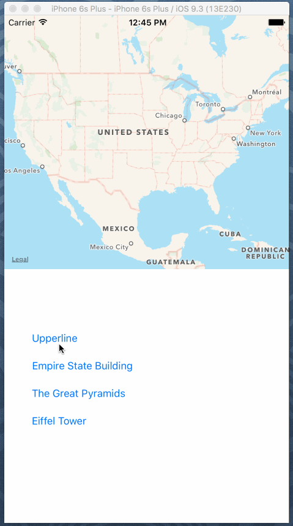

# MapKit Lab

The goal for today's lab is to create a simple mapkit app that displays the location of different landmarks on a map.

Make sure to use the following:
1. MapKit object
2. At least 3 buttons
3. Constraints
4. Optionals
5. Dictionary

To get you started, here are the latitudes and longitudes of different landmarks.

                         Name | Lat            | Long           |
------------------------------|----------------|:--------------:|
 Upperline School of Code     |  40.709        | -74.010
 Empire State Building        |  40.748        | -73.986
 The Great Pyramids of Giza   |  29.979        | 31.134
 The Eiffel Tower             |  48.858        | 2.295

 You don't have to use the landmarks above--feel free to look up the latitudes and longitudes of your favorite locations! 